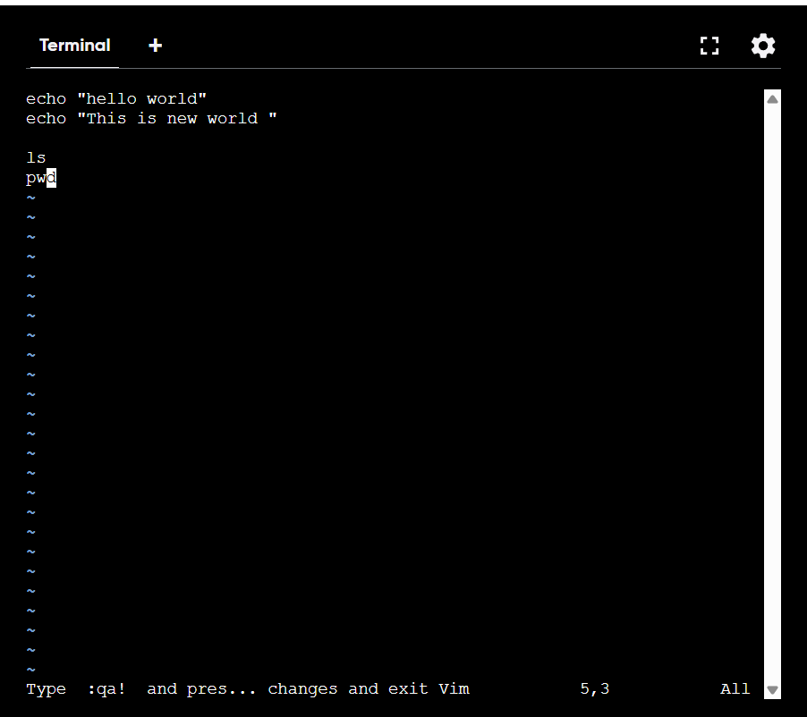
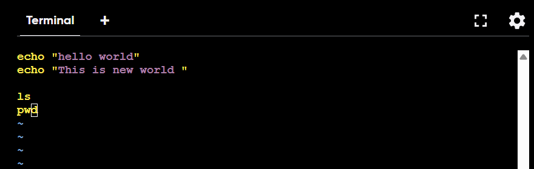

# Shell Scripting
## What is shell scripting
<p>Shell scripting is the process of writing a sequence of commands in a plain text file for a shell (a command-line interpreter) to execute as a single program. It allows users to automate repetitive tasks, manage system configurations, and batch-process data by combining simple commands into complex, automated workflows.  </p>

## Application of Shell Scripting
<p>
1) Easy Documentation using script file what you did.<br>
2) Repetative task can be done easily.<br>
3) It can be used with other tools (terraform , jenkins etc)
</p>

## First Shell Script File

``` 
$ vi first.txt
```
press i



<b>Shift + : </b> <br> <b>wq e</b> 

```
$ ls
first.txt

$ ls -l
total 4
-rw-r--r-- 1 root root 45 Apr 26 15:52 first.txt
```

as we can see in above that no execution permit is present so we have to give it

```
$ chmod +x first.txt  

$ ls -l
total 4
-rwxr-xr-x 1 root root 45 Apr 26 15:52 first.txt
```
Executing Shell Script File

```
$ ./first.txt 
hello world
This is new world
```

now the problem is you can use text file but the problem is you wont be able to find error easily by colours because it will show White text So for that you have to create .sh file



## Shebang
